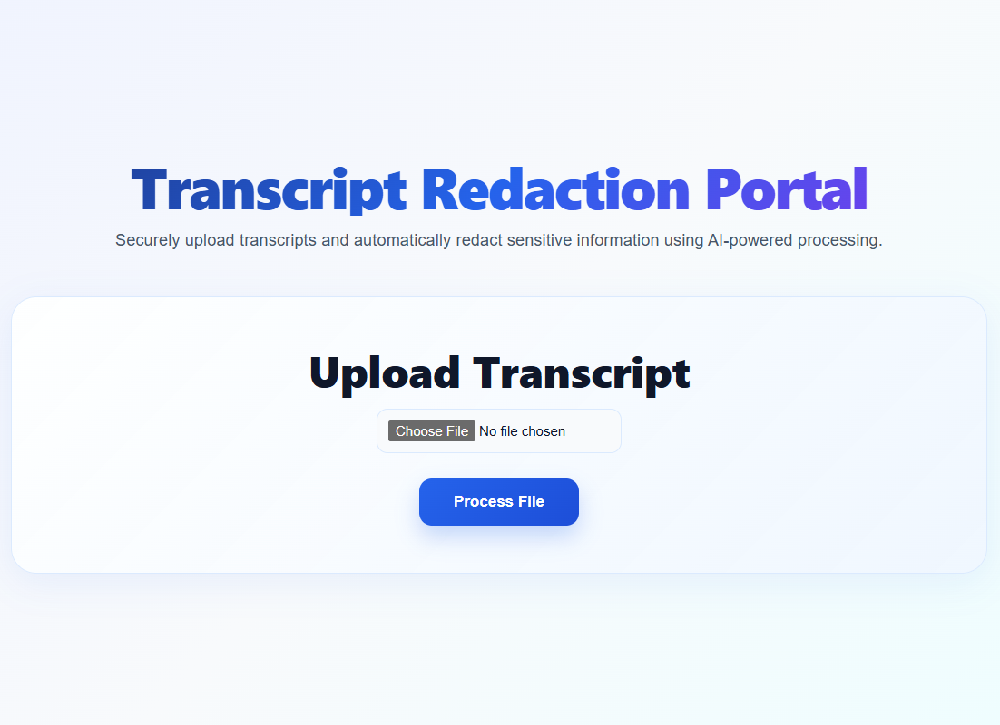
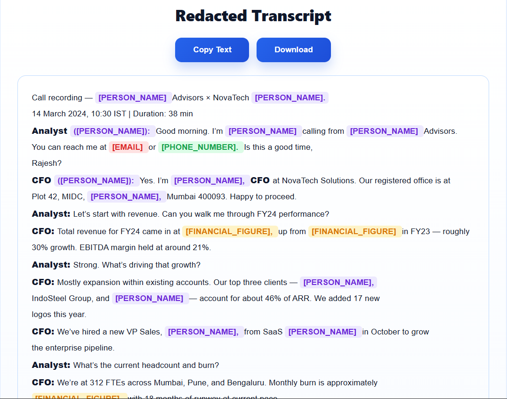
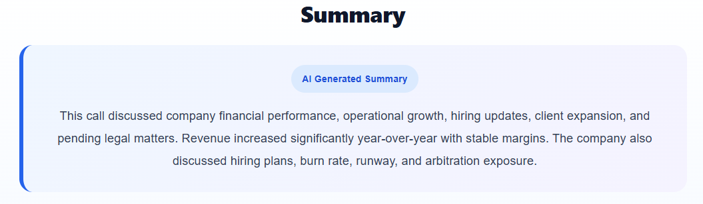
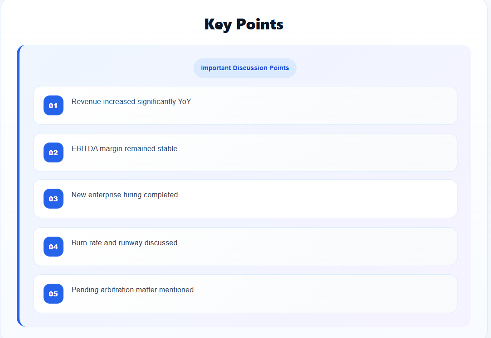
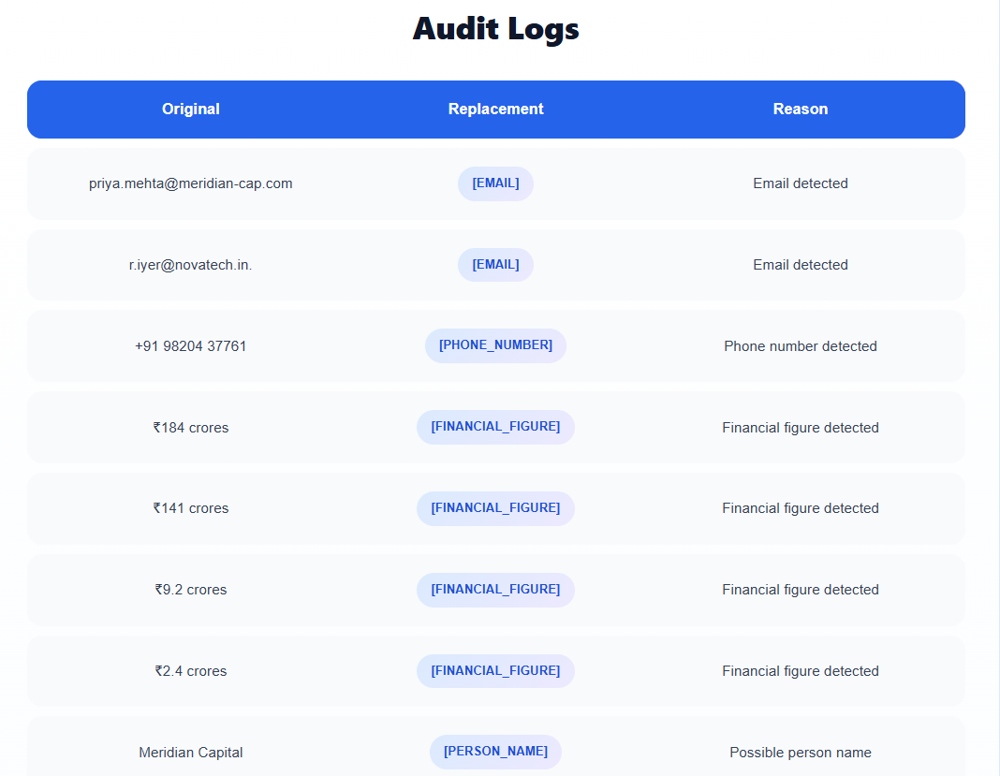

# Transcript Redaction Portal

An AI-powered full-stack web portal that automatically redacts sensitive information from uploaded business call transcripts and generates structured summaries and key discussion points.

---

# Features

* Upload transcript files (TXT, PDF, DOCX)
* Automatic PII redaction
* Email address masking
* Phone number masking
* Financial figure redaction
* Legal counsel and sensitive entity masking
* AI-generated summaries using Gemini API
* AI-generated key points extraction
* Audit logs showing detected entities and replacement reasons
* Download redacted transcript
* Copy transcript functionality
* Responsive modern UI

---

# Tech Stack

## Frontend

* React
* Axios
* CSS

## Backend

* Spring Boot
* Java
* REST APIs

## AI Integration

* Google Gemini API

---

# Redaction Strategy

The portal uses a hybrid redaction approach combining:

* Regex-based entity detection
* Rule-based masking
* Typed placeholders
* AI-powered summarization

Sensitive entities are replaced with placeholders such as:

* `[PERSON_NAME]`
* `[EMAIL]`
* `[PHONE_NUMBER]`
* `[FINANCIAL_FIGURE]`

---

# Supported File Types

* TXT
* PDF
* DOCX

---

# How to Run

## Backend

```bash
cd backend
set GEMINI_API_KEY=YOUR_API_KEY
mvn spring-boot:run
```

Backend runs on:

```bash
http://localhost:8080
```

---

## Frontend

```bash
cd frontend
npm install
npm run dev
```

Frontend runs on:

```bash
http://localhost:5173
```

---

# API Endpoint

## Upload Transcript

```bash
POST /api/upload
```

Accepts multipart file uploads.

---

# Error Handling

The portal gracefully handles:

* Unsupported file types
* Empty uploads
* API failures
* Invalid processing requests

---

# Security

* API keys stored using environment variables
* No transcript persistence
* No sensitive data stored in logs
* Typed placeholders used for all redactions

---

# Architecture Overview

## Flow

1. User uploads transcript
2. Backend extracts text
3. Redaction service masks sensitive entities
4. Gemini API generates:

   * Summary
   * Key points
5. Frontend displays:

   * Redacted transcript
   * Summary
   * Key points
   * Audit logs

---

# Future Improvements

* Named Entity Recognition (NER) models
* Confidence scoring
* Export as PDF
* Authentication and user roles
* Better contextual redaction

---

# Screenshots

## Home Page



---

## Redacted Transcript



---

## Summary



---

## Key Points



---

## Audit Logs




# Author

Astha Adhikari
